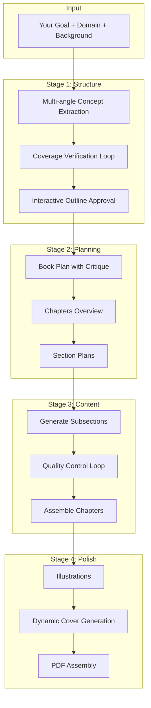

# Learner

> **Take anyone to the cutting edge of any knowledge domain. No barriers. No compromises.**

[](https://www.python.org/downloads/)
[](https://ai.google.dev/)
[](https://github.com/SynaLinks/synalinks)

---

## The Problem

The book you need doesn't exist.

The knowledge is out there — scattered across papers, videos, blogs, and textbooks. But none of it is written for **your specific goal**, in **your domain**, at **your level**, in **your language**.

A decade-long pipeline stands between breakthrough and accessibility:
1. Research happens → 2. Years of academic validation → 3. Years for practitioners to apply → 4. Years to diffuse across domains → 5. Years for textbooks → 6. Years for courses → 7. **Finally** you can learn it

**We collapse this entire pipeline to hours.**

---

## What We Do

**Synthesize the exact book each person needs — taking them from wherever they are to the cutting edge.**

Not personalized. Not adapted. **Synthesized from scratch** for one person:

| Dimension | How It Shapes Your Book |
|-----------|------------------------|
| **Your exact knowledge state** | What you know, what you think you know but don't, the gaps you don't know exist |
| **Your specific goal** | Not "learn ML" but "build a trading bot using reinforcement learning for illiquid markets" |
| **Your domain** | Every example, analogy, and case study speaks your professional language |
| **Your native language** | Full fluency in your mother tongue, not awkward translation |
| **Your learning style** | Visual, textual, example-driven, theory-first — however your brain works |
| **Your constraints** | 20-minute focus windows, screen reader compatibility, dyslexia-friendly formatting |
| **Your pace** | Dense and fast, or gentle and thorough — exactly the gradient you can climb |

---

## Breaking All Barriers

**Geographic**: The best education clusters in wealthy cities. We bring world-class synthesis anywhere.

**Economic**: Elite education costs hundreds of thousands. We democratize access.

**Linguistic**: 95% of scientific papers are in English. We synthesize in any language.

**Institutional**: The cutting edge lives in labs and PhD programs. We open the gates.

**Cognitive**: Traditional education assumes neurotypical brains. We adapt to how YOU learn.

**Temporal**: By the time knowledge reaches textbooks, it's years old. We synthesize from the frontier.

---

## Collapsing the Knowledge Pipeline

Technique published Monday → Complete personalized learning path by Tuesday.

A quantitative researcher reads about a new neural architecture. By the next day, she has a complete learning path — grounded in finance examples, building on what she already knows, taking her from concept to implementation.

**This isn't just about individual opportunity. It's about accelerating human progress.**

---

## Quick Start

```bash
# 1. Clone
git clone https://github.com/anthropics/learner.git
cd learner

# 2. Install
pip install -r requirements.txt

# 3. Configure
echo "GEMINI_API_KEY=your_key_here" > .env

# 4. Generate
python main.py --config configs/neurosymbolic.yaml --chapters 3
```

Your book will be in `output/<timestamp>/06_full_book.pdf`

---

## Architecture



---

## Key Features

| Feature | Description |
|---------|-------------|
| **Extreme Precision** | Infinite dimensions of personalization — not 4 categories, YOUR exact situation |
| **Intelligent Planning** | Self-critique loops ensure specificity, alignment, and coherence |
| **Quality Control** | Feedback loops catch repetition, gaps, and inconsistencies |
| **Cutting Edge Synthesis** | Pull from latest papers, documentation, cross-domain insights |
| **Any Language** | Full synthesis in 40+ languages |
| **Resumable** | Crashed? Resume from where you left off |

---

## Who It's For

**Everyone who's been failed by one-size-fits-all education:**

- The career changer whose decades of experience are dismissed as irrelevant
- The gifted student in Bangladesh who deserves world-class resources in Bangla
- The deaf entrepreneur watching the learning economy shift to video
- The chronic illness warrior who can only focus 20 minutes at a time
- The researcher who needs to master a new field in weeks, not years
- Anyone who ever thought: "The book I need doesn't exist"

---

## Documentation

- **[VISION.md](VISION.md)** - Our mission and principles
- **[WORKFLOW.md](WORKFLOW.md)** - Detailed pipeline documentation
- **[MVP_PLAN.md](MVP_PLAN.md)** - Product roadmap

---

## Technology

- **[Synalinks](https://github.com/SynaLinks/synalinks)** - Neuro-symbolic LLM framework
- **[Google Gemini](https://ai.google.dev/)** - LLM and image generation
- **[WeasyPrint](https://weasyprint.org/)** - PDF generation

---

## License

MIT License - see [LICENSE](LICENSE) for details.

---

<p align="center">
  <b>Knowledge, perfectly tailored. For everyone.</b><br>
  <i>Removing friction from the engine of human advancement.</i>
</p>
