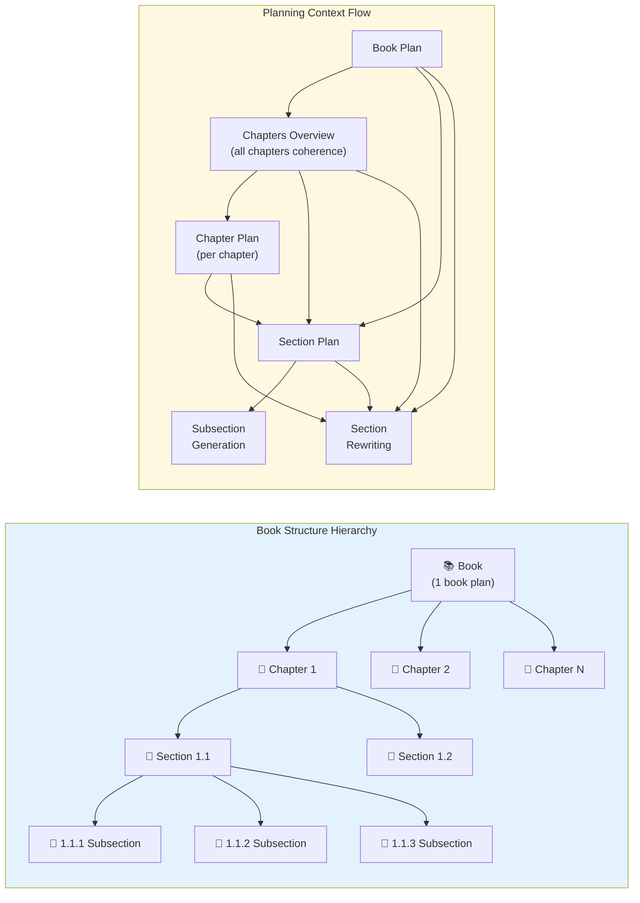

# Book Generator Workflow

This document describes the workflow logic for the AI-powered book generation system built with Synalinks.

## Overview

The book generator creates comprehensive educational books through a multi-stage pipeline that ensures coherent, well-structured content with minimal repetition.

```
Topic Input → Outline Generation → Outline Reorganization → Hierarchical Planning → Subsection Content → Section Rewriting → Chapter Polishing → Cover Generation → Final Book
                                   (temporal/conceptual)     (Book → Chapter → Section)
```





```mermaid
flowchart TD
    subgraph Stage1["Stage 1: Outline Generation"]
        A[Topic Input] --> B1[Branch 1<br/>temp=1.0]
        A --> B2[Branch 2<br/>temp=1.0]
        A --> B3[Branch 3-8<br/>temp=1.0]
        B1 --> C[Merge & Deduplicate]
        B2 --> C
        B3 --> C
        C --> D[Expand Subconcepts]
        D --> E[Review & Enrich]
        E --> F[Expand Sub-subconcepts]
        F --> G[Verify Relevance]
        G --> H[DeepHierarchy<br/>3-level outline]
    end

    subgraph Stage1b["Stage 1b: Outline Reorganization"]
        H --> H1{Analyze for<br/>evolution pattern}
        H1 -->|Has evolution| H2[Reorder chapters<br/>by temporal/conceptual flow]
        H1 -->|No evolution| H3[Keep original order]
        H2 --> H4[Reorganized Outline]
        H3 --> H4
    end

    subgraph Stage2["Stage 2: Hierarchical Planning"]
        H4 --> I[Generate Book Plan]
        I --> J1[Generate Chapters Overview<br/>one-shot for coherence]
        J1 --> J2[Generate Chapter Plans<br/>per chapter with overview context]
        J2 --> K[Generate Section Plans<br/>per chapter with full context]
    end

    subgraph Stage3["Stage 3: Subsection Generation"]
        K --> L{For each subsection}
        L --> M[Pass Context:<br/>Book Plan +<br/>Chapter Plan +<br/>Section Plan]
        M --> N[Generate Content:<br/>Explanation +<br/>Analogies/Examples]
        N --> L
    end

    subgraph Stage4["Stage 4: Section Rewriting"]
        N --> O{For each section}
        O --> P[Collect subsections]
        P --> P2[Pass full context:<br/>Book Plan +<br/>Chapters Overview +<br/>Chapter Plan +<br/>Section Plan]
        P2 --> Q[Apply intro style<br/>rotating 1-8]
        Q --> R[Rewrite as<br/>coherent section<br/>preserving depth]
        R --> O
        R --> S[Combine sections<br/>into chapter]
    end

    subgraph Stage5["Stage 5: Chapter Polishing"]
        S --> T{For each chapter}
        T --> U[Polish for cohesion]
        U --> W[Add transitions<br/>& detail]
        W --> X[Improve prose<br/>quality]
        X --> T
    end

    subgraph Stage6["Stage 6: Cover Generation"]
        X --> CVR[Generate cover<br/>with Imagen 4.0]
        CVR --> CVRIMG[book_cover.png]
    end

    subgraph Stage7["Stage 7: Final Assembly & PDF"]
        CVRIMG --> Y[Combine all chapters]
        Y --> Z[Add cover & TOC]
        Z --> TXT[06_full_book.txt]
        Z --> PDF[Generate PDF<br/>with cover]
        PDF --> BOOK[06_full_book.pdf]
    end

    style Stage1 fill:#e1f5fe
    style Stage1b fill:#e0f7fa
    style Stage2 fill:#fff3e0
    style Stage3 fill:#e8f5e9
    style Stage4 fill:#fce4ec
    style Stage5 fill:#e8eaf6
    style Stage6 fill:#fff9c4
    style Stage7 fill:#f3e5f5
```

## Pipeline Stages

### Stage 1: Outline Generation

**Input:** `Topic` (topic, goal, book_name)

**Process:**
1. **Multi-branch concept extraction** - 8 parallel generators (temperature=1.0) independently extract main concepts from the topic
2. **Merge & deduplicate** - All branches are merged and deduplicated into a unified concept list
3. **Subconcept expansion** - Each main concept is expanded with 5-10 specific subconcepts
4. **Review & enrich** - A review pass adds any missing concepts or subconcepts
5. **Sub-subconcept expansion** - Each subconcept is expanded with 3-7 detailed sub-subconcepts
6. **Relevance verification** - Final pass removes off-topic or too-generic items

**Output:** `DeepHierarchy` - 3-level hierarchy (Concepts → Subconcepts → Sub-subconcepts)

**Files saved:**
- `01_outline.json` - Full outline in JSON format
- `01_outline.txt` - Human-readable outline

---

### Stage 1b: Outline Reorganization

**Input:** `OutlineReorganizationInput` (topic, goal, current_outline)

**Process:**
The LLM analyzes the generated outline to determine if reorganizing chapters would better reflect:
1. **Historical/temporal evolution** - How concepts developed over time
2. **Conceptual progression** - Foundational concepts before advanced ones
3. **Logical dependencies** - Concepts that build on each other

If reorganization makes sense:
- Identifies the optimal order that tells a coherent story of how ideas evolved
- Ensures foundational/prerequisite concepts come before those that depend on them
- Maintains narrative flow from simpler to more complex ideas
- Reorders chapters without losing any content

If the current order is already optimal or reorganization doesn't apply:
- Keeps the original order
- Explains why reorganization wasn't needed

**Output:** `ReorganizedOutline` (should_reorganize, reasoning, chapter_order)

**Files saved:**
- `01_outline_reorganized.json` - Reorganized outline (only if changed)
- `01_outline_reorganized.txt` - Human-readable reorganized outline (only if changed)

---

### Stage 2: Hierarchical Planning

Planning happens at four levels: book → chapters overview → individual chapter plans → sections. This ensures coherent narrative flow throughout while giving each chapter focused attention.

#### 2a: Book Plan Generation

**Input:** `BookPlanInput` (topic, goal, book_name, full_outline)

**Note:** The `full_outline` includes all three levels (concepts → subconcepts → subsubconcepts), giving the planner complete visibility of every topic that will be covered in the book.

**Process:**
- Generate high-level book plan covering the overall narrative arc
- Describe how chapters connect and build upon each other
- Define what readers will learn and key takeaways

**Output:** `BookPlan` (book_summary, narrative_arc, chapter_connections)

**Files saved:**
- `02_book_plan.json` - Book plan in JSON format
- `02_book_plan.txt` - Human-readable book plan

#### 2b: Chapters Overview Generation (One-Shot for Coherence)

**Input:** `ChaptersOverviewInput` (topic, goal, book_name, full_outline, book_plan, chapters)

**Note:** The `full_outline` includes all three levels, so the overview planner sees every subsection topic when planning chapter connections.

**Process:**
- Generate a high-level overview of ALL chapters in a single LLM call
- This provides the "birds-eye view" showing how chapters connect
- Includes narrative flow and brief role for each chapter
- Generated once for coherence, then used as context for individual chapter planning

**Output:** `ChaptersOverview` (narrative_flow, chapter_briefs: List of `ChapterBrief`)

Each `ChapterBrief` contains: chapter_name, brief_role, key_concepts, builds_on, leads_to

**Files saved:**
- `02_chapters_overview.json` - Chapters overview in JSON format
- `02_chapters_overview.txt` - Human-readable chapters overview

#### 2c: Individual Chapter Plans Generation (Per-Chapter with Full Context)

**Input:** `SingleChapterPlanInput` (topic, goal, book_name, full_outline, book_plan, chapters_overview, chapter_name, chapter_number, total_chapters)

**Process:**
- For each chapter individually, generate a detailed plan
- Uses the chapters overview as context for coherence
- Each plan uses the EXACT chapter name provided (no name drift)
- Plans are generated one at a time for focused attention

**Output:** `ChapterPlan` (chapter_name, chapter_summary, role_in_book, connection_to_previous, connection_to_next)

**Files saved:**
- `02_chapter_plan_NN_<chapter>.json` - Individual chapter plan files
- `02_chapter_plans.json` - Combined chapter plans in JSON format

**Why two-stage chapter planning?**
- **Stage 1 (one-shot overview)**: Ensures coherence - the LLM sees all chapters together to plan cross-chapter connections
- **Stage 2 (per-chapter plans)**: Ensures quality - each chapter gets focused attention with exact name matching

#### 2d: Section Plans Generation (Per-Chapter with Full Context)

**Input:** `SectionPlansInput` (topic, goal, book_name, book_plan, chapters_overview, chapter_plan, chapter_name, sections, subsections_by_section)

**Process:**
- For each chapter, generate plans for all sections
- Receives full context: book plan, chapters overview, and chapter plan
- Each section plan describes its content, role in the chapter, and overview of subsections

**Output:** `ChapterSectionPlans` (chapter_name, section_plans: List of `SectionPlan`)

**Files saved:**
- `02_section_plans_<chapter>.json` - Section plans for each chapter

**Why hierarchical planning with full context?** Each level receives all context from above:
- Book plan provides overall narrative arc
- Chapters overview provides cross-chapter coherence
- Chapter plan provides specific chapter goals
This ensures coherence and prevents overlap at every level.

---

### Stage 3: Subsection Content Generation

**Input:** `SectionInput` (topic, goal, book_name, book_plan, chapter_plan, section_plan, current_subsection)

**Process:**
For each sub-subconcept (leaf node in the outline):
1. Pass hierarchical context: book plan, chapter plan, and section plan
2. Generate core content: concept explanation and analogies/examples
3. Introduction and summary are handled at the section level during rewriting

**Output:** `SectionOutput` for each subsection:
- `concept_explanation` - Thorough explanation of core concepts
- `analogies_and_examples` - Relatable analogies and practical examples

**Note:** No introduction or summary is generated per subsection. These are created during section rewriting to ensure cohesive flow across the entire section.

**Files saved:**
- `03_subsection_NNN_<name>.txt` - Each individual subsection
- `03_subsection_NNN_<name>.json` - JSON format for resume capability

---

### Stage 4: Section Rewriting & Chapter Assembly

**Input:** `ChapterInput` (topic, goal, book_name, audience, book_plan, chapters_overview, chapter_plan, section_plan, chapter_title, section_name, subsections_content, previous_section_summary, next_section_summary, intro_style)

**Note:** The section rewriter receives **full planning context** (book plan, chapters overview, chapter plan, section plan) so it understands what depth and coverage is expected for each section. This prevents content condensation during rewriting.

**Process:**
1. For each section within a chapter:
   - Collect all subsections belonging to that section
   - Pass full planning context: book plan, chapters overview, chapter plan, section plan
   - Select an introduction style from rotating list of 8 styles
   - Rewrite subsections into a coherent section with the specified intro style
   - Use section plan to guide the narrative and maintain comprehensive depth
2. Combine all rewritten sections into a complete chapter

**Output:** `ChapterOutput` - Full chapter content with coherent sections

**Introduction Styles (rotated per section to avoid repetition):**
1. Thought-provoking question
2. Real-world problem/challenge
3. Historical context
4. Connection to previous chapters
5. Surprising fact/counterintuitive insight
6. Practical scenario
7. Problem space definition
8. Comparison to familiar concept

**Rewriting goals:**
- Follow the assigned intro style for each section opening
- **Maintain comprehensive depth** - keep ALL technical content from subsections
- The rewritten section should be AT LEAST as long as the combined subsections
- Improve flow and eliminate redundancy within sections
- Add smooth transitions between topics
- Create natural narrative arc (beginning, middle, end)
- Write in flowing prose (no headers/bullet points within sections)
- Section headers (`## Section Name`) separate sections within the chapter

**Files saved:**
- `04_chapter_NNN_<name>.txt` - Each complete chapter with all rewritten sections

---

### Stage 5: Chapter Polishing

**Input:** `ChapterPolishInput` (topic, goal, book_name, audience, book_plan, chapters_overview, chapter_name, chapter_number, total_chapters, chapter_plan, chapter_content, previous_chapter_summary, next_chapter_summary)

**Process:**
For each chapter, perform a final polish pass with full planning context:
1. Uses book plan and chapters overview to understand broader narrative
2. Ensures all sections flow together as one unified chapter
3. Adds smooth transitions between sections
4. Adds clarifying detail where concepts feel thin
5. Removes redundant content across sections
6. Creates a clear narrative arc (beginning, middle, end)
7. Improves prose quality and professional tone
8. References previous/next chapters naturally for continuity

**Output:** `PolishedChapter` (chapter_content)

**Polishing goals:**
- COHESION: Sections should read as one unified piece, not separate articles
- TRANSITIONS: Smooth flow between topics with no abrupt changes
- DETAIL: Add examples and explanations where needed
- REDUNDANCY: Remove repetitive content
- NARRATIVE: Clear arc from introduction through synthesis
- PROSE: Professional book-quality writing
- CONTEXT: Leverage full book plan and chapters overview for coherence

**Files saved:**
- `05_polished_NNN_<name>.txt` - Each polished chapter

---

### Stage 6: Cover Generation

**Process:**
- Generate a professional book cover using Google's Imagen 4.0 model
- Cover includes: book title, subtitle, and authors
- The prompt is kept minimal to let the AI decide the best visual design

**Input:** Book metadata (title, subtitle, authors from config)

**Output:** PNG image suitable for book cover (3:4 aspect ratio)

**Files saved:**
- `book_cover.png` - Generated book cover image

---

### Stage 7: Final Book Assembly & PDF Generation

**Process:**
- Combine all polished chapters into a single document
- Add cover image as the first page
- Add table of contents
- Convert markdown to styled PDF with professional book formatting

**PDF Features:**
- A4 page size with proper margins
- Full-page cover image on first page
- Two-column table of contents
- Serif font (Georgia) for readability
- Automatic page numbers (except on cover)
- Chapter titles in header
- Page breaks before each chapter
- Styled headings, blockquotes, and code blocks
- Justified text with hyphenation

**Files saved:**
- `06_full_book.txt` - Complete book (Markdown)
- `06_full_book.pdf` - Complete book (PDF with cover)

---

## Data Models

### Input Models
| Model | Fields | Purpose |
|-------|--------|---------|
| `Topic` | topic, goal, book_name | Initial book specification |
| `OutlineReorganizationInput` | topic, goal, current_outline | Input for outline reorganization analysis |
| `BookPlanInput` | topic, goal, book_name, full_outline | Input for book plan generation |
| `ChaptersOverviewInput` | topic, goal, book_name, full_outline, book_plan, chapters | Input for chapters overview generation |
| `SingleChapterPlanInput` | topic, goal, book_name, full_outline, book_plan, chapters_overview, chapter_name, chapter_number, total_chapters | Input for individual chapter plan generation |
| `SectionPlansInput` | topic, goal, book_name, book_plan, chapters_overview, chapter_plan, chapter_name, sections, subsections_by_section | Input for section plans generation |
| `SectionInput` | topic, goal, book_name, audience, book_plan, chapter_plan, section_plan, current_subsection | Input for subsection generation |
| `ChapterInput` | topic, goal, book_name, audience, book_plan, chapters_overview, chapter_plan, section_plan, chapter_title, section_name, subsections_content, previous_section_summary, next_section_summary, intro_style | Input for section rewriting (with full planning context) |
| `ChapterPolishInput` | topic, goal, book_name, audience, book_plan, chapters_overview, chapter_name, chapter_number, total_chapters, chapter_plan, chapter_content, previous_chapter_summary, next_chapter_summary | Input for chapter polishing |

### Output Models
| Model | Fields | Purpose |
|-------|--------|---------|
| `DeepHierarchy` | concepts (list of ConceptDeep) | 3-level outline structure |
| `ReorganizedOutline` | should_reorganize, reasoning, chapter_order | Outline reorganization decision and new order |
| `BookPlan` | book_summary, narrative_arc, chapter_connections | High-level book plan |
| `ChaptersOverview` | narrative_flow, chapter_briefs (list of ChapterBrief) | High-level overview of all chapters for coherence |
| `AllChapterPlans` | chapter_plans (list of ChapterPlan) | Plans for all chapters (combined) |
| `ChapterSectionPlans` | chapter_name, section_plans (list of SectionPlan) | Section plans for one chapter |
| `SectionOutput` | concept_explanation, analogies_and_examples | Generated subsection content |
| `ChapterOutput` | chapter_content | Rewritten coherent section/chapter content |
| `PolishedChapter` | chapter_content | Final polished chapter with improved flow and detail |

### Planning Models
| Model | Fields | Purpose |
|-------|--------|---------|
| `ChapterBrief` | chapter_name, brief_role, key_concepts, builds_on, leads_to | Brief overview of a chapter's role (used in ChaptersOverview) |
| `ChapterPlan` | chapter_name, chapter_summary, role_in_book, connection_to_previous, connection_to_next | Detailed plan for a single chapter |
| `SectionPlan` | section_name, section_summary, role_in_chapter, subsections_overview | Plan for a single section |

### Intermediate Models
| Model | Fields | Purpose |
|-------|--------|---------|
| `ConceptExtractor` | main_concepts, thinking | Branch output for concept extraction |
| `MergedConcepts` | main_concepts | Deduplicated concept list |
| `HierarchicalConcepts` | concepts (list of ConceptWithSubconcepts), thinking | 2-level hierarchy |
| `ConceptDeep` | concept, subconcepts (list of SubconceptWithDetails) | Concept with nested subconcepts |

---

## Output Directory Structure

Each run creates a timestamped directory under `output/`:

```
output/
└── YYYYMMDD_HHMMSS/
    ├── 00_topic.txt                    # Input topic, goal, book name
    ├── 00_test_mode.txt                # Test mode indicator (if enabled)
    ├── 01_outline.json                 # Full outline (JSON)
    ├── 01_outline.txt                  # Full outline (readable)
    ├── 01_outline_reorganized.json     # Reorganized outline (if changed)
    ├── 01_outline_reorganized.txt      # Reorganized outline (if changed)
    ├── 02_book_plan.json               # Book-level plan (JSON)
    ├── 02_book_plan.txt                # Book-level plan (readable)
    ├── 02_chapters_overview.json       # Chapters overview for coherence (JSON)
    ├── 02_chapters_overview.txt        # Chapters overview (readable)
    ├── 02_chapter_plan_01_*.json       # Individual chapter plans (JSON)
    ├── 02_chapter_plan_02_*.json
    ├── ...
    ├── 02_chapter_plans.json           # All chapter plans combined (JSON)
    ├── 02_section_plans_*.json         # Section plans per chapter
    ├── 03_subsection_001_*.txt         # Individual subsections (readable)
    ├── 03_subsection_001_*.json        # Individual subsections (JSON)
    ├── 03_subsection_002_*.txt
    ├── ...
    ├── 04_chapter_001_*.txt            # Rewritten chapters with sections
    ├── 04_chapter_002_*.txt
    ├── ...
    ├── 05_polished_001_*.txt           # Polished chapters (final quality)
    ├── 05_polished_002_*.txt
    ├── ...
    ├── book_cover.png                  # Generated book cover image
    ├── 06_full_book.txt                # Final combined book (Markdown)
    └── 06_full_book.pdf                # Final combined book (PDF with cover)
```

---

## Key Design Decisions

### Why outline reorganization?
The initial outline extraction captures all relevant concepts, but the order may not reflect the natural evolution of ideas. Reorganization analyzes the outline to:
- **Respect temporal evolution**: For topics with historical development, earlier concepts come first
- **Build conceptual foundations**: Prerequisites and fundamentals appear before advanced topics
- **Improve narrative flow**: The book tells a coherent story from beginning to end

This step only reorganizes if it makes sense for the topic. For topics without clear evolution patterns, the original order is preserved.

### Why full outline for planners, short outline for book display?
The system uses two outline formats:
- **Full outline** (3 levels: concepts → subconcepts → subsubconcepts): Used by planners (book plan, chapters overview, chapter plans) so they can see ALL topics that will be covered
- **Short outline** (2 levels: concepts → subconcepts): Used for book display (introduction, table of contents) where subsection detail is too granular

This ensures planners have complete visibility when designing the book structure, while the book itself shows a cleaner, more readable table of contents.

### Why multi-branch concept extraction?
Using 8 parallel generators with high temperature produces diverse concept lists. Merging and deduplicating gives comprehensive coverage that a single pass might miss.

### Why hierarchical planning?
Planning at four levels (book → chapters overview → chapter plans → sections) ensures:
- The book has a coherent narrative arc from start to finish
- All chapters are planned with awareness of each other (via chapters overview)
- Each chapter gets focused individual attention (via per-chapter planning)
- Each section understands how it contributes to its chapter
- No overlap or redundancy between parts

### Why two-stage chapter planning?
Chapter planning uses a two-stage approach:
1. **Chapters Overview (one-shot)**: Generate a high-level overview of ALL chapters in one LLM call. This ensures coherence - the LLM sees all chapters together and can plan how they connect, what builds on what, and the overall narrative flow.
2. **Individual Chapter Plans (per-chapter)**: Generate detailed plans for each chapter individually, using the overview as context. This ensures quality - each chapter gets focused attention, and the plan uses the exact chapter name (no name drift issues).

This combines the benefits of one-shot coherence with per-chapter quality and reliability.

### Why pass full context to each stage?
Each generator receives the complete planning hierarchy:
- **Subsection generation**: book plan + chapter plan + section plan
- **Section plans**: book plan + chapters overview + chapter plan
- **Section rewriting**: book plan + chapters overview + chapter plan + section plan
- **Chapter polishing**: book plan + chapters overview + chapter plan

This allows each stage to:
- Understand where the content fits in the book's narrative
- Avoid repeating content from other parts
- Write content that flows naturally with adjacent material
- Maintain consistency with the overall book goals
- **Maintain comprehensive depth** - knowing what each section should accomplish prevents content condensation

### Why no intro/summary per subsection?
Introductions and summaries are generated at the section level during rewriting. This ensures:
- One cohesive introduction per section instead of repetitive per-subsection intros
- The section rewriter can craft transitions knowing all the subsection content

### Why rotating intro styles at section level?
Without explicit style guidance, LLMs tend to fall into repetitive patterns (e.g., "Imagine..."). Each section gets a different introduction style from a rotating list of 8 approaches:
1. Thought-provoking question
2. Real-world problem/challenge
3. Historical context
4. Connection to previous chapters
5. Surprising fact/counterintuitive insight
6. Practical scenario
7. Problem space definition
8. Comparison to familiar concept

### Why section rewriting?
Individual subsections, while comprehensive, read like separate pieces. The section rewriting pass:
- Merges subsections into flowing narrative within each section
- Eliminates redundancy between subsections
- Adds transitions
- Creates a professional book section feel
- Sections are then combined into complete chapters

### Why chapter polishing with full context?
Even after section rewriting, chapters can feel like assembled pieces rather than unified wholes. The final polish pass receives the full planning context (book plan, chapters overview, chapter plan) and:
- Uses the broader narrative context to ensure coherence
- Ensures sections flow together as one cohesive chapter
- Adds smooth transitions between sections
- Adds detail where concepts feel thin
- Removes any remaining redundancy across sections
- Creates a clear narrative arc for the entire chapter
- Improves prose to publication-quality
- References adjacent chapters for continuity

---

## Test Mode

For faster iteration and testing, enable test mode by setting these variables at the top of `book.py`:

```python
TEST_MODE = True  # Set to False for full book generation
TEST_MAX_CHAPTERS = 2  # Number of chapters to rewrite in test mode
```

When `TEST_MODE = True`:
- Only subsections for the first `TEST_MAX_CHAPTERS` chapters are generated
- Only those chapters are rewritten
- A `00_test_mode.txt` file is created in the output directory

Set `TEST_MODE = False` for full book generation.

---

## Resume from Crash

If the generation crashes partway through, you can resume from where it left off:

```python
RESUME_FROM_DIR = "output/20240115_143022"  # Path to previous run's output directory
```

When resuming:
- The existing output directory is reused
- **Outline**: Loaded from `01_outline.json` if it exists
- **Reorganized Outline**: Loaded from `01_outline_reorganized.json` if it exists
- **Book Plan**: Loaded from `02_book_plan.json` if it exists
- **Chapters Overview**: Loaded from `02_chapters_overview.json` if it exists
- **Chapter Plans**: Individual plans loaded from `02_chapter_plan_NN_*.json`, or combined from `02_chapter_plans.json`
- **Section Plans**: Each chapter's section plans loaded from `02_section_plans_*.json` if exists
- **Subsections**: Each subsection is skipped if `03_subsection_NNN_*.txt` exists
- **Chapters**: Each chapter is skipped if `04_chapter_NNN_*.txt` exists
- **Polished Chapters**: Each polished chapter is skipped if `05_polished_NNN_*.txt` exists
- Only missing outputs are generated

Set `RESUME_FROM_DIR = None` for a fresh run.

**Tip**: After a crash, check the output directory to see which files were generated, then set `RESUME_FROM_DIR` to that directory path.

---

## Extending the Workflow

### Adding new stages
1. Create input/output data models
2. Add generator function
3. Call from `main()` in appropriate order
4. Add file saving

### Customizing content style
- Adjust generator `instructions` for different writing styles
- Modify `ChapterOutput` instructions to change chapter tone/format
- Add style parameters to input models as needed

### Parallel processing
The current implementation is sequential. For parallel subsection generation:
```python
results = await asyncio.gather(*[generate_section(s) for s in sections])
```

---

## Dependencies

Install required packages:

```bash
pip install synalinks python-dotenv markdown weasyprint google-genai
```

**Note:** `weasyprint` requires some system dependencies for PDF generation:

- **macOS:** `brew install pango`
- **Ubuntu/Debian:** `apt-get install libpango-1.0-0 libpangocairo-1.0-0`
- **Windows:** See [WeasyPrint documentation](https://doc.courtbouillon.org/weasyprint/stable/first_steps.html#installation)

You also need a `.env` file with your API keys:
```
GEMINI_API_KEY=your_key_here
```

The `GEMINI_API_KEY` is used for both the LLM (via synalinks/litellm) and cover image generation (via Imagen 4.0).
