# Book Generator Workflow

This document describes the workflow logic for the AI-powered book generation system built with Synalinks.

## Overview

The book generator creates comprehensive educational books through a multi-stage pipeline that ensures coherent, well-structured content with minimal repetition.

```
Topic/Outline → Approval (edit/approve) → Prioritization → Subsubconcepts → Reorganization → Planning → Content + QC → Illustrations → Assembly → PDF
                (interactive)              (if num_chapters)  (if missing)      (temporal flow)   (hierarchical)  (feedback loop)   (optional)
```

## Pipeline Diagram


## Quality Control Detail




```mermaid
flowchart LR
    subgraph Hierarchy["Book Structure Hierarchy"]
        direction TB
        Book["📚 Book<br/>(1 book plan)"]
        Book --> Ch1["📖 Chapter 1"]
        Book --> Ch2["📖 Chapter 2"]
        Book --> ChN["📖 Chapter N"]

        Ch1 --> S11["📄 Section 1.1"]
        Ch1 --> S12["📄 Section 1.2"]

        S11 --> SS111["📠1.1.1 Subsection"]
        S11 --> SS112["📠1.1.2 Subsection"]
        S11 --> SS113["📠1.1.3 Subsection"]
    end

    subgraph Planning["Planning Context Flow"]
        direction TB
        BP["Book Plan"] --> CO["Chapters Overview<br/>(all chapters coherence)"]
        CO --> CP["Chapter Plan<br/>(per chapter)"]
        BP --> SP["Section Plan"]
        CO --> SP
        CP --> SP
        BP --> DW["Direct Write<br/>(per section)"]
        CO --> DW
        CP --> DW
        SP --> DW
    end

    style Hierarchy fill:#e3f2fd
    style Planning fill:#fff8e1
```

## Pipeline Stages

### Stage 1: Outline Generation with Coverage Check

**Input:** `Topic` (topic, goal, book_name)

**Process:**

1. **Multi-branch concept extraction** - 4 parallel generators (temperature=1.0) independently extract main concepts from the topic

2. **Merge & deduplicate** - All branches are merged and deduplicated into a unified concept list

3. **Enrichment phase** - 3 parallel enrichment passes identify missing concepts:
   - Foundational/theoretical concepts
   - Historical/evolution concepts
   - Practical/application concepts
   - Advanced/emerging concepts
   - Cross-cutting themes
   - Methodology concepts

4. **Coverage check loop** (max 3 attempts):
   - Compare generated concepts against the book's goal
   - Identify any topics mentioned in the goal that are NOT covered
   - If missing topics found → generate additional concepts to fill gaps
   - Repeat until coverage is adequate

5. **Expand to 3-level hierarchy**:
   - Generate subconcepts for each main concept
   - Review and add missing subconcepts
   - Generate sub-subconcepts for each subconcept

6. **Relevance verification** - Final pass removes off-topic items

**Key Functions:**
- `generate_outline_with_coverage()` - Main entry point with coverage loop
- `generate_main_concepts()` - Multi-branch concept extraction
- `check_coverage()` - Validate concepts against book goal
- `generate_missing_concepts()` - Create concepts for coverage gaps
- `expand_to_hierarchy()` - Build 3-level structure

**Output:** `DeepHierarchy` - 3-level hierarchy (Concepts → Subconcepts → Sub-subconcepts)

**Files saved:**
- `01_outline.json` - Full outline in JSON format
- `01_outline.txt` - Human-readable outline

---

### Stage 1a: Interactive Outline Approval

**Purpose:** Allow user to review, edit, and approve the outline before proceeding with generation.

**Process:**
- Display generated outline with all chapters and subconcepts
- User options:
  - **[y]es / Enter**: Approve and continue
  - **[e]dit**: Open outline in text editor for manual changes
  - **[r]egenerate**: Generate new outline (with coverage check)
  - **[q]uit**: Cancel generation

**Edit Mode:**
When you choose `[e]dit`, the outline is saved to `01_outline_edit.yaml` and opened in your `$EDITOR` (defaults to nano). The format is:

```yaml
- Chapter Name:
    - Section 1
    - Section 2
- Another Chapter:
    - Section A
    - Section B
```

You can:
- Delete chapters or sections by removing lines
- Add new chapters with `- New Chapter:`
- Add new sections with `    - New Section`
- Reorder by moving lines

After saving and closing the editor, the changes are applied.

**Config:** `interactive_outline_approval: bool` (default: True)

**Note:** This stage is skipped when resuming from a previous run.

---

### Stage 1a2: Chapter Prioritization (if num_chapters is set)

**Purpose:** Select the most important chapters when you want a focused book rather than comprehensive coverage.

**When it runs:**
- When `num_chapters` is set in config AND there are more chapters than that limit

**Config:**
- `num_chapters: int` - Number of chapters to select
- `focus: str` - Specific focus areas to prioritize (optional)

**Example config:**
```yaml
num_chapters: 8
focus: |
  Intersection of LLMs with neuro-symbolic AI, knowledge graphs,
  agentic reasoning, and RAG systems. Practical implementation patterns.
```

**Process:**
1. Evaluate each chapter's relevance to goal, audience, and focus
2. Select the N most important chapters
3. Order by importance (most important first)
4. Ensure foundational prerequisites are included

**Prioritization criteria:**
- Relevance to focus areas (highest priority)
- Foundational value (prerequisites for focus)
- Practical value for the audience
- Coherence as a learning path

**Output:** Filtered outline saved as `01_outline_prioritized.json`

---

### Stage 1a3: Subsubconcept Generation (if missing)

**Purpose:** Generate detailed subsection topics when the outline only has chapters and sections.

**When it runs:**
- When using a `default_outline` that has empty `subsubconcepts: []`
- When editing an outline and not specifying subsubconcepts

**Process:**
1. Check if any subconcept has subsubconcepts
2. If all are empty, generate 3-5 subsubconcepts per section
3. Verify relevance to book topic

**Output:** Updated outline with populated subsubconcepts

---

### Stage 1b: Outline Reorganization

**Input:** `OutlineReorganizationInput` (topic, goal, current_outline)

**Process:**
The LLM analyzes the generated outline to determine if reorganizing chapters would better reflect:
1. **Historical/temporal evolution** - How concepts developed over time
2. **Conceptual progression** - Foundational concepts before advanced ones
3. **Logical dependencies** - Concepts that build on each other

If reorganization makes sense:
- Identifies the optimal order that tells a coherent story of how ideas evolved
- Ensures foundational/prerequisite concepts come before those that depend on them
- Maintains narrative flow from simpler to more complex ideas
- Reorders chapters without losing any content

If the current order is already optimal or reorganization doesn't apply:
- Keeps the original order
- Explains why reorganization wasn't needed

**Output:** `ReorganizedOutline` (should_reorganize, reasoning, chapter_order)

**Files saved:**
- `01_outline_reorganized.json` - Reorganized outline (only if changed)
- `01_outline_reorganized.txt` - Human-readable reorganized outline (only if changed)

---

### Stage 2: Hierarchical Planning

Planning happens at four levels: book → chapters overview → individual chapter plans → sections. This ensures coherent narrative flow throughout while giving each chapter focused attention.

#### 2a: Book Plan Generation

**Input:** `BookPlanInput` (topic, goal, book_name, full_outline)

**Note:** The `full_outline` includes all three levels (concepts → subconcepts → subsubconcepts), giving the planner complete visibility of every topic that will be covered in the book.

**Process:**
- Generate high-level book plan covering the overall narrative arc
- Describe how chapters connect and build upon each other
- Define what readers will learn and key takeaways

**Output:** `BookPlan` (book_summary, narrative_arc, chapter_connections)

**Files saved:**
- `02_book_plan.json` - Book plan in JSON format
- `02_book_plan.txt` - Human-readable book plan

#### 2b: Chapters Overview Generation (One-Shot for Coherence)

**Input:** `ChaptersOverviewInput` (topic, goal, book_name, full_outline, book_plan, chapters)

**Note:** The `full_outline` includes all three levels, so the overview planner sees every subsection topic when planning chapter connections.

**Process:**
- Generate a high-level overview of ALL chapters in a single LLM call
- This provides the "birds-eye view" showing how chapters connect
- Includes narrative flow and brief role for each chapter
- Generated once for coherence, then used as context for individual chapter planning

**Output:** `ChaptersOverview` (narrative_flow, chapter_briefs: List of `ChapterBrief`)

Each `ChapterBrief` contains: chapter_name, brief_role, key_concepts, builds_on, leads_to

**Files saved:**
- `02_chapters_overview.json` - Chapters overview in JSON format
- `02_chapters_overview.txt` - Human-readable chapters overview

#### 2c: Individual Chapter Plans Generation (Per-Chapter with Full Context)

**Input:** `SingleChapterPlanInput` (topic, goal, book_name, full_outline, book_plan, chapters_overview, chapter_name, chapter_number, total_chapters)

**Process:**
- For each chapter individually, generate a detailed plan
- Uses the chapters overview as context for coherence
- Each plan uses the EXACT chapter name provided (no name drift)
- Plans are generated one at a time for focused attention

**Output:** `ChapterPlan` (chapter_name, chapter_summary, role_in_book, connection_to_previous, connection_to_next)

**Files saved:**
- `02_chapter_plan_NN_<chapter>.json` - Individual chapter plan files
- `02_chapter_plans.json` - Combined chapter plans in JSON format

**Why two-stage chapter planning?**
- **Stage 1 (one-shot overview)**: Ensures coherence - the LLM sees all chapters together to plan cross-chapter connections
- **Stage 2 (per-chapter plans)**: Ensures quality - each chapter gets focused attention with exact name matching

#### 2d: Section Plans Generation (Per-Chapter with Full Context)

**Input:** `SectionPlansInput` (topic, goal, book_name, book_plan, chapters_overview, chapter_plan, chapter_name, sections, subsections_by_section)

**Process:**
- For each chapter, generate plans for all sections
- Receives full context: book plan, chapters overview, and chapter plan
- Each section plan describes its content, role in the chapter, and overview of subsections

**Output:** `ChapterSectionPlans` (chapter_name, section_plans: List of `SectionPlan`)

**Files saved:**
- `02_section_plans_<chapter>.json` - Section plans for each chapter

**Why hierarchical planning with full context?** Each level receives all context from above:
- Book plan provides overall narrative arc
- Chapters overview provides cross-chapter coherence
- Chapter plan provides specific chapter goals
This ensures coherence and prevents overlap at every level.

---

### Stage 3: Content Generation with Quality Control

**Architecture:**
Each section is generated with full planning context and undergoes quality control. If quality fails, feedback is injected and subsections are regenerated.

```
For each chapter:
  1. Generate chapter introduction (puts chapter in book context)
  For each section:
    2. Generate section introduction (previews subsections)
    3. Write all subsections with plan context
    4. Assemble section
    5. Quality check loop (max 5 attempts):
       - Check for repetition, coherence, depth, structure
       - If FAIL: inject feedback into plan, regenerate subsections
       - If PASS: continue to next section
  6. Assemble chapter: header + intro + sections
```

**Quality Control Loop:**

The quality check examines:
- **Repetition**: Same content repeated across subsections
- **Coherence**: Logical flow between subsections
- **Depth**: Appropriate technical depth for audience
- **Structure**: Clear organization with transitions

When quality fails:
1. Feedback is extracted from the quality assessment
2. Feedback is prepended to the section plan
3. Subsections are regenerated with the augmented plan
4. Loop continues until pass (max 5 attempts)

**Key Functions:**
- `write_all_sections_direct()` - Main content orchestration
- `write_section_with_subsections()` - Section writing with QC loop
- `check_section_quality()` - Quality assessment returning (passed, feedback)
- `write_single_subsection()` - Individual subsection generation

**Inputs:**

- `SubsectionInput` (topic, goal, book_name, audience, full_outline, book_plan, chapters_overview, chapter_name, chapter_plan, section_name, section_plan, subsection_name) + optional `WritingStyle`
- `SectionIntroInput` (topic, book_name, chapter_name, section_name, section_plan, subsection_names, intro_style)
- `ChapterIntroInput` (topic, book_name, book_plan, chapters_overview, chapter_name, chapter_number, total_chapters, chapter_plan, section_names)

**Process:**

1. **Chapter Introduction**: Each chapter starts with an introduction that:
   - Places the chapter in the context of the ENTIRE BOOK narrative
   - Explains what the reader has learned so far (if not first chapter)
   - Previews what the chapter covers and why it matters
   - Connects to the book's overall goal
   - 3-4 paragraphs in flowing prose

2. **Section Introduction**: Each section starts with an introduction that:
   - Sets context for what the section covers
   - Explains why these topics matter
   - Previews what the reader will learn
   - Uses a rotating intro style for variety
   - 2-3 paragraphs in flowing prose

3. **Subsection Generation**:
   - Each subsection written with full planning context
   - Receives: book plan, chapters overview, chapter plan, section plan
   - Optional writing style applied during generation
   - 500-1000+ words per subsection

4. **Assembly and Quality Check**:
   - Subsections assembled with `####` headers
   - Section = section intro + subsections
   - Quality check validates the assembled section
   - If fail: feedback injected, subsections regenerated
   - If pass: continue to next section

5. **Chapter Assembly**:
   - Chapter = chapter header (`##`) + chapter intro + sections (`###`)
   - No separate rewriting pass needed

**Introduction Styles (rotated per section to avoid repetition):**
- Question-based openings (thought-provoking, fundamental questions)
- Problem-based openings (real-world problems, practical scenarios)
- Context-based openings (historical context, connections to previous sections)
- Insight-based openings (surprising facts, paradoxes, misconceptions)
- Definition-based openings (problem space definition, distinguishing concepts)
- Motivation-based openings (why practitioners care, practical benefits)
- Example-based openings (concrete examples, running examples)
- Contrast-based openings (naive vs sophisticated approaches)
- Forward-looking openings (previews, roadmaps)

**Depth Requirements:**
- **500-1000 words per subsection** (or more if needed to fully explain)
- Each subsection gets comprehensive, textbook-quality coverage

**Explanation Approach:**
- **STEP-BY-STEP**: Break down complex ideas into sequential, logical steps. Start from first principles, build understanding incrementally, make reasoning explicit.
- **SELF-CONTAINED**: Define ALL terms when first used. Each subsection should stand on its own - a reader should understand without reading previous chapters.
- **NO ASSUMED PRIOR KNOWLEDGE**: Explain jargon immediately, don't skip "obvious" steps, build from ground zero for each concept, include the "why" behind every "what".
- **IN-DEPTH**: Go beyond definitions to true understanding. Explain intuition behind formal concepts, show how things work internally, address "how" and "why" questions.

**Required Coverage for Each Subsection:**
- DEFINITION: What is this concept? Define it precisely and completely
- MECHANICS: How does it work? Explain the underlying principles in detail
- SIGNIFICANCE: Why does this matter? What problems does it solve?
- EXAMPLES: Multiple concrete, specific examples that illustrate different aspects
- NUANCES: Edge cases, common misconceptions, limitations, important caveats
- CONNECTIONS: How does this relate to other concepts in the section/chapter?

**Files saved:**
- `03_section_NNN_<name>.txt` - Each complete section (intro + subsections)
- `04_chapter_<name>.txt` - Each complete chapter (intro + sections)

---

### Stage 4: Illustrations (Optional)

**Purpose:** Add visual content to enhance understanding.

**Process:**
1. Analyze chapter content for diagram opportunities
2. Generate Mermaid diagrams (flowcharts, sequence diagrams, etc.)
3. Optionally generate AI images using configured model

**Config:**
- `enable_illustrations: bool` (default: False)
- `enable_generated_images: bool` (default: True)
- `image_model: str` (default: "gemini/imagen-3.0-generate-002")

**Files saved:**
- `04_illustrated_*.txt` - Illustrated chapter content

---

### Stage 5: Introduction Generation

**Purpose:** Create a compelling book introduction.

**Process:**
- Hook: Compelling observation about the field
- Context: Why this topic matters now
- Problem: Challenges the book addresses
- Approach: Book's methodology
- Roadmap: High-level section overview
- Audience: Who benefits most
- Invitation: Encouraging note to reader

**Files saved:**
- `00_introduction.txt` - Book introduction
- `00_introduction.json` - Introduction metadata

---

### Stage 6: Cover Generation

**Process:**
- Generate a professional book cover using configured image model
- Cover includes: book title, subtitle, and authors
- The prompt is kept minimal to let the AI decide the best visual design

**Input:** Book metadata (title, subtitle, authors from config)

**Output:** PNG image suitable for book cover (3:4 aspect ratio)

**Files saved:**
- `book_cover.png` - Generated book cover image

---

### Stage 7: Final Book Assembly & PDF Generation

**Process:**
- Combine all chapters into a single document
- Add cover image as the first page
- Add table of contents
- Convert markdown to styled PDF with professional book formatting

**PDF Features:**
- A4 page size with proper margins
- Full-page cover image on first page
- Two-column table of contents
- Serif font (Georgia) for readability
- Automatic page numbers (except on cover)
- Chapter titles in header
- Page breaks before each chapter
- Styled headings, blockquotes, and code blocks
- Justified text with hyphenation

**Files saved:**
- `06_full_book.txt` - Complete book (Markdown)
- `06_full_book.pdf` - Complete book (PDF with cover)

---

## Data Models

### Input Models
| Model | Fields | Purpose |
|-------|--------|---------|
| `Topic` | topic, goal, book_name | Initial book specification |
| `CoverageCheckInput` | topic, goal, current_concepts | Input for coverage validation |
| `OutlineReorganizationInput` | topic, goal, current_outline | Input for outline reorganization analysis |
| `BookPlanInput` | topic, goal, book_name, full_outline | Input for book plan generation |
| `ChaptersOverviewInput` | topic, goal, book_name, full_outline, book_plan, chapters | Input for chapters overview generation |
| `SingleChapterPlanInput` | topic, goal, book_name, full_outline, book_plan, chapters_overview, chapter_name, chapter_number, total_chapters | Input for individual chapter plan generation |
| `SectionPlansInput` | topic, goal, book_name, book_plan, chapters_overview, chapter_plan, chapter_name, sections, subsections_by_section | Input for section plans generation |
| `SubsectionInput` | topic, goal, book_name, audience, full_outline, book_plan, chapters_overview, chapter_name, chapter_plan, section_name, section_plan, subsection_name | Input for subsection generation (with full context) |
| `SectionIntroInput` | topic, book_name, chapter_name, section_name, section_plan, subsection_names, intro_style | Input for section intro generation |
| `ChapterIntroInput` | topic, book_name, book_plan, chapters_overview, chapter_name, chapter_number, total_chapters, chapter_plan, section_names | Input for chapter intro generation |

### Output Models
| Model | Fields | Purpose |
|-------|--------|---------|
| `DeepHierarchy` | concepts (list of ConceptDeep) | 3-level outline structure |
| `CoverageAssessment` | thinking, covered_topics, missing_topics, coverage_adequate | Coverage validation result |
| `MissingConceptsAddition` | thinking, new_concepts | Concepts to add for coverage gaps |
| `QualityAssessment` | thinking, verdict, issues | Section quality check result |
| `ReorganizedOutline` | should_reorganize, reasoning, chapter_order | Outline reorganization decision and new order |
| `BookPlan` | book_summary, narrative_arc, chapter_connections | High-level book plan |
| `ChaptersOverview` | narrative_flow, chapter_briefs (list of ChapterBrief) | High-level overview of all chapters for coherence |
| `AllChapterPlans` | chapter_plans (list of ChapterPlan) | Plans for all chapters (combined) |
| `ChapterSectionPlans` | chapter_name, section_plans (list of SectionPlan) | Section plans for one chapter |
| `SubsectionContent` | content | Single subsection content from one branch |
| `ConsolidatedSubsection` | content | Best/synthesized subsection from multi-branch consolidation |
| `SectionIntro` | introduction | Section introduction (2-3 paragraphs) |
| `ChapterIntro` | introduction | Chapter introduction that puts it in book context |

### Planning Models
| Model | Fields | Purpose |
|-------|--------|---------|
| `ChapterBrief` | chapter_name, brief_role, key_concepts, builds_on, leads_to | Brief overview of a chapter's role (used in ChaptersOverview) |
| `ChapterPlan` | chapter_name, chapter_summary, role_in_book, connection_to_previous, connection_to_next | Detailed plan for a single chapter |
| `SectionPlan` | section_name, section_summary, role_in_chapter, subsections_overview | Plan for a single section |

### Intermediate Models
| Model | Fields | Purpose |
|-------|--------|---------|
| `ConceptExtractor` | main_concepts, thinking | Branch output for concept extraction |
| `MergedConcepts` | main_concepts | Deduplicated concept list |
| `HierarchicalConcepts` | concepts (list of ConceptWithSubconcepts), thinking | 2-level hierarchy |
| `ConceptDeep` | concept, subconcepts (list of SubconceptWithDetails) | Concept with nested subconcepts |

---

## Output Directory Structure

Each run creates a timestamped directory under `output/`:

```
output/
└── YYYYMMDD_HHMMSS/
    ├── 00_topic.txt                    # Input topic, goal, book name
    ├── 00_test_mode.txt                # Test mode indicator (if enabled)
    ├── 00_introduction.txt             # Book introduction
    ├── 00_introduction.json            # Introduction metadata
    │
    ├── 01_outline.json                 # Full outline (JSON)
    ├── 01_outline.txt                  # Full outline (readable)
    ├── 01_reorganization_analysis.json # Reorganization reasoning
    ├── 01_outline_reorganized.json     # Reorganized outline (if changed)
    ├── 01_outline_reorganized.txt      # Reorganized outline (if changed)
    │
    ├── 02_book_plan.json               # Book-level plan (JSON)
    ├── 02_book_plan.txt                # Book-level plan (readable)
    ├── 02_chapters_overview.json       # Chapters overview for coherence
    ├── 02_chapters_overview.txt        # Chapters overview (readable)
    ├── 02_chapter_plan_01_*.json       # Individual chapter plans
    ├── 02_chapter_plan_02_*.json
    ├── ...
    ├── 02_chapter_plans.json           # All chapter plans combined
    ├── 02_section_plans_*.json         # Section plans per chapter
    │
    ├── 03_chapter_XX_*.txt             # Chapter content files
    ├── ...
    │
    ├── 04_illustrated_*.txt            # Illustrated chapters (if enabled)
    ├── ...
    │
    ├── book_cover.png                  # Generated book cover image
    ├── 06_full_book.txt                # Final combined book (Markdown)
    └── 06_full_book.pdf                # Final combined book (PDF with cover)
```

---

## Key Design Decisions

### Why coverage check loop?
The book's goal specifies what topics SHOULD be covered. Initial concept generation might miss some important topics, especially:
- Specific technologies mentioned in the goal (e.g., AUTOSAR, real-time constraints)
- Domain-specific requirements
- Advanced topics the user explicitly requested

The coverage check loop:
1. Compares generated concepts against the goal text
2. Identifies any topics mentioned in the goal that aren't covered
3. Generates additional concepts specifically for those gaps
4. Repeats until coverage is adequate (max 3 attempts)

This ensures the final book actually covers everything the user asked for.

### Why interactive outline approval?
Before investing significant compute in content generation, users should verify the outline meets their needs:
- See all chapters and subconcepts at a glance
- Regenerate if important topics are missing
- Quit early if the direction is wrong

This saves time and resources by catching issues early.

### Why quality control with feedback loop?
Even with full planning context, generated content can have issues:
- Repetition across subsections
- Incoherent flow between topics
- Insufficient depth for complex concepts

The quality control loop:
1. Checks assembled sections for common issues
2. Extracts specific feedback (what's wrong, how to fix)
3. Injects feedback into the section plan
4. Regenerates subsections with the augmented plan
5. Continues until quality passes (max 5 attempts)

This is more efficient than whole-section rewrites because:
- Subsection-level regeneration is faster
- Feedback is specific and actionable
- The original structure is preserved

### Why outline reorganization?
The initial outline extraction captures all relevant concepts, but the order may not reflect the natural evolution of ideas. Reorganization analyzes the outline to:
- **Respect temporal evolution**: For topics with historical development, earlier concepts come first
- **Build conceptual foundations**: Prerequisites and fundamentals appear before advanced topics
- **Improve narrative flow**: The book tells a coherent story from beginning to end

This step only reorganizes if it makes sense for the topic. For topics without clear evolution patterns, the original order is preserved.

### Why full outline for planners, short outline for book display?
The system uses two outline formats:
- **Full outline** (3 levels: concepts → subconcepts → subsubconcepts): Used by planners (book plan, chapters overview, chapter plans) so they can see ALL topics that will be covered
- **Short outline** (2 levels: concepts → subconcepts): Used for book display (introduction, table of contents) where subsection detail is too granular

This ensures planners have complete visibility when designing the book structure, while the book itself shows a cleaner, more readable table of contents.

### Why multi-branch concept extraction?
Using 8 parallel generators with high temperature produces diverse concept lists. Merging and deduplicating gives comprehensive coverage that a single pass might miss.

### Why hierarchical planning?
Planning at four levels (book → chapters overview → chapter plans → sections) ensures:
- The book has a coherent narrative arc from start to finish
- All chapters are planned with awareness of each other (via chapters overview)
- Each chapter gets focused individual attention (via per-chapter planning)
- Each section understands how it contributes to its chapter
- No overlap or redundancy between parts

### Why two-stage chapter planning?
Chapter planning uses a two-stage approach:
1. **Chapters Overview (one-shot)**: Generate a high-level overview of ALL chapters in one LLM call. This ensures coherence - the LLM sees all chapters together and can plan how they connect, what builds on what, and the overall narrative flow.
2. **Individual Chapter Plans (per-chapter)**: Generate detailed plans for each chapter individually, using the overview as context. This ensures quality - each chapter gets focused attention, and the plan uses the exact chapter name (no name drift issues).

This combines the benefits of one-shot coherence with per-chapter quality and reliability.

### Why pass full context to direct write?
Each section writer receives the complete planning hierarchy:
- **Direct write**: book plan + chapters overview + chapter plan + section plan + topic names

This allows the writer to:
- Understand where the content fits in the book's narrative
- Avoid repeating content from other parts
- Write content that flows naturally with adjacent material
- Maintain consistency with the overall book goals
- **Maintain comprehensive depth** - knowing what each section should accomplish prevents content condensation

### Why generate subsections separately with full context?
Instead of writing whole sections at once, each subsection is generated independently because:
- **More detail and rigor**: Each subsection gets focused attention for comprehensive coverage
- **Full planning context**: Each subsection receives book plan, chapters overview, chapter plan, section plan, AND the full outline
- **Multi-branch quality**: 3 parallel versions with consolidation ensures the best explanation
- **No compression**: When a whole section is written at once, topics may get uneven treatment
- **Natural assembly**: Full context means subsections fit together without rewriting

### Why multi-branch generation for subsections?
Using the same synalinks pattern as outline generation:
1. Generate 3 versions in parallel with temperature=1.0 for diversity
2. Merge branches with `&` operator
3. Consolidate with a final generator that selects/refines the best version

This ensures:
- Diversity in explanations and examples
- Selection of the most comprehensive version
- Ability to synthesize the best elements from multiple branches

### Why chapter and section introductions?
- **Chapter intro**: Places the chapter in the context of the ENTIRE BOOK narrative, explains what the reader has learned so far, previews what's ahead
- **Section intro**: Sets context for the section's topics, explains why they matter, previews what the reader will learn

These intros make the book flow naturally without needing a separate rewriting pass.

### Why assembly by concatenation (no rewriting)?
After subsection generation with full context:
- Each subsection already knows where it fits in the book's narrative
- Introductions handle transitions between sections and chapters
- Simple concatenation produces coherent chapters
- Avoids content compression that occurs during "rewrite" passes

### Why apply style during subsection generation (not as separate pass)?
Testing showed that a separate styling pass caused significant content compression:
- Chapters lost 25-55% of their content when restyled
- The LLM interpreted "rewrite in this style" as "summarize in this style"
- By applying style during subsection generation, we get both style AND depth
- Style instructions are prepended to depth requirements, making it clear that style ≠ shorter

### Why concept enrichment after merging?
After 8 branches extract concepts and they're merged, a dedicated enrichment step reviews the list and adds any important missing concepts:
- Foundational/theoretical concepts that experts would consider essential
- Historical/evolution concepts showing how the field developed
- Practical/application concepts for real-world use
- Advanced/emerging concepts for cutting-edge coverage
- Cross-cutting themes that span multiple areas
- Methodology concepts covering key techniques

This happens BEFORE subconcept expansion, ensuring comprehensive coverage from the start.

### Why step-by-step, self-contained explanations?
Each explanation must be:
- **Step-by-step**: Complex ideas broken into sequential steps, starting from first principles
- **Self-contained**: All terms defined when first used; readable without prior chapters
- **No assumed knowledge**: Jargon explained immediately; "obvious" steps included
- **In-depth**: Beyond definitions to true understanding; intuition behind formal concepts

This ensures the book is accessible to readers entering at any chapter while maintaining depth.

### Why rotating intro styles at section level?
Without explicit style guidance, LLMs tend to fall into repetitive patterns (e.g., "Imagine..."). Each section gets a different introduction style from a rotating list of approaches:
1. Thought-provoking question
2. Real-world problem/challenge
3. Historical context
4. Connection to previous chapters
5. Surprising fact/counterintuitive insight
6. Practical scenario
7. Problem space definition
8. Comparison to familiar concept

---

## Default Outline

You can provide a pre-defined outline in the config file to skip the outline generation stage entirely. This is useful when:
- You have a specific structure in mind
- You want to reproduce a previous outline exactly
- You want to iterate on content without re-generating the structure

Add a `default_outline` section to your YAML config:

```yaml
default_outline:
  - concept: "Chapter 1 Title"
    subconcepts:
      - subconcept: "Section 1.1 Title"
        subsubconcepts: []
      - subconcept: "Section 1.2 Title"
        subsubconcepts: []
  - concept: "Chapter 2 Title"
    subconcepts:
      - subconcept: "Section 2.1 Title"
        subsubconcepts: []
```

When `default_outline` is provided:
- Outline generation is skipped entirely
- The default outline is saved to `01_outline.json`
- Interactive approval still applies (you can regenerate if needed)
- Reorganization stage still runs to optimize chapter order

---

## Test Mode

For faster iteration and testing, enable test mode by setting these variables at the top of `book.py`:

```python
TEST_MODE = True  # Set to False for full book generation
TEST_MAX_CHAPTERS = 2  # Number of chapters to rewrite in test mode
```

When `TEST_MODE = True`:
- Only the first `TEST_MAX_CHAPTERS` chapters are generated
- A `00_test_mode.txt` file is created in the output directory

Set `TEST_MODE = False` for full book generation.

---

## Resume from Crash

If the generation crashes partway through, you can resume from where it left off:

```python
RESUME_FROM_DIR = "output/20240115_143022"  # Path to previous run's output directory
```

When resuming:
- The existing output directory is reused
- **Outline**: Loaded from `01_outline.json` if it exists
- **Reorganized Outline**: Loaded from `01_outline_reorganized.json` if it exists
- **Book Plan**: Loaded from `02_book_plan.json` if it exists
- **Chapters Overview**: Loaded from `02_chapters_overview.json` if it exists
- **Chapter Plans**: Individual plans loaded from `02_chapter_plan_NN_*.json`, or combined from `02_chapter_plans.json`
- **Section Plans**: Each chapter's section plans loaded from `02_section_plans_*.json` if exists
- **Sections**: Each section is skipped if `03_section_NNN_*.txt` exists
- **Chapters**: Each chapter is skipped if `04_chapter_*.txt` exists
- Only missing outputs are generated

Set `RESUME_FROM_DIR = None` for a fresh run.

**Tip**: After a crash, check the output directory to see which files were generated, then set `RESUME_FROM_DIR` to that directory path.

---

## Extending the Workflow

### Adding new stages
1. Create input/output data models
2. Add generator function
3. Call from `main()` in appropriate order
4. Add file saving

### Customizing content style
- Adjust generator `instructions` for different writing styles
- Modify `ChapterOutput` instructions to change chapter tone/format
- Add style parameters to input models as needed

### Parallel processing
The current implementation is sequential. For parallel section writing:
```python
results = await asyncio.gather(*[write_section(s) for s in sections])
```

---

## Dependencies

Install required packages:

```bash
pip install synalinks python-dotenv markdown weasyprint google-genai
```

**Note:** `weasyprint` requires some system dependencies for PDF generation:

- **macOS:** `brew install pango`
- **Ubuntu/Debian:** `apt-get install libpango-1.0-0 libpangocairo-1.0-0`
- **Windows:** See [WeasyPrint documentation](https://doc.courtbouillon.org/weasyprint/stable/first_steps.html#installation)

You also need a `.env` file with your API keys:
```
GEMINI_API_KEY=your_key_here
```

The `GEMINI_API_KEY` is used for both the LLM (via synalinks/litellm) and cover image generation (via Imagen 4.0).
